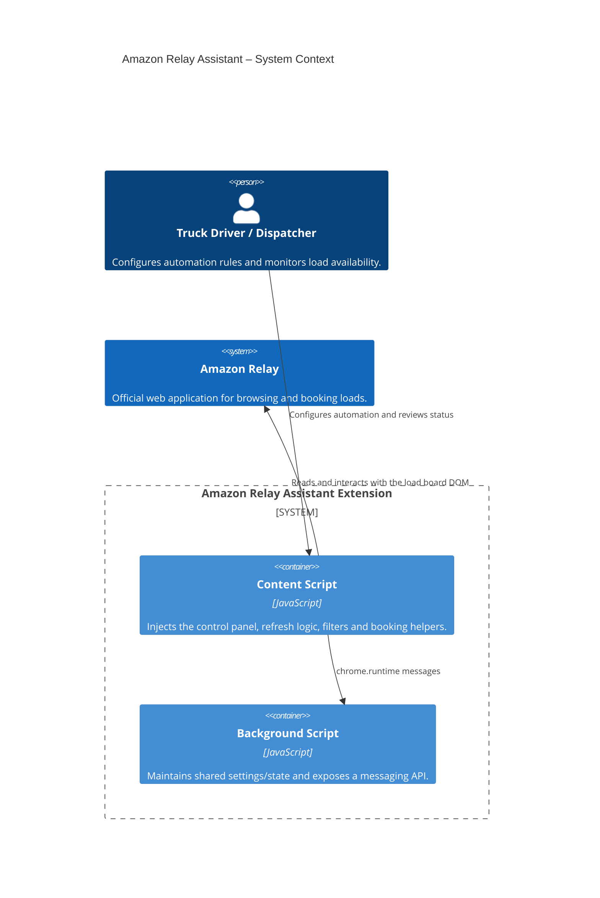
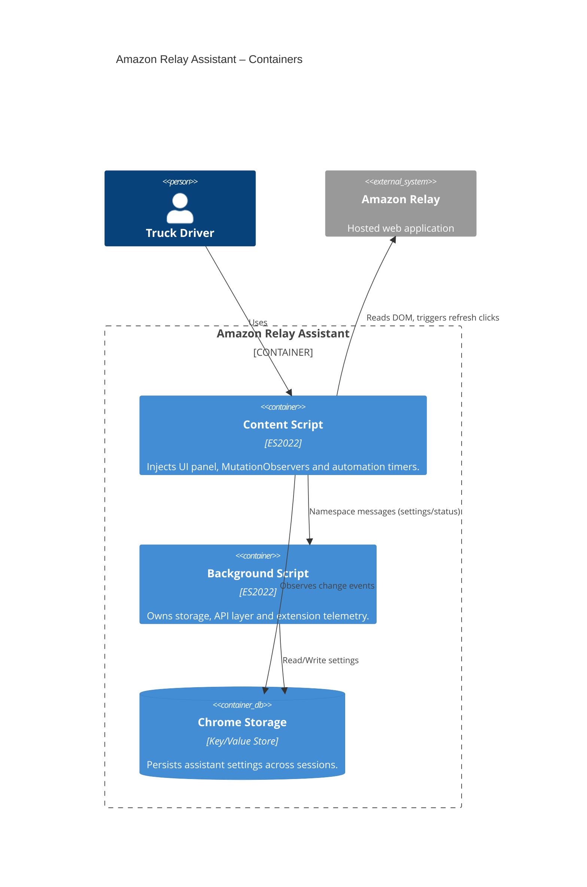
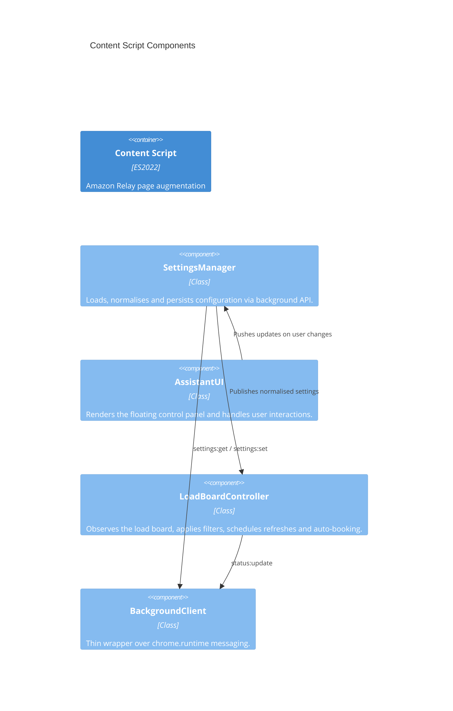

# Amazon Relay Assistant – C4 Architecture Model

## Level 1 – System Context
The Amazon Relay Assistant browser extension augments the Amazon Relay load board experience for drivers and dispatchers. It operates entirely within the browser, reading the load board DOM, applying user-configurable rules, and optionally performing automated actions on behalf of the user.

## Level 2 – Container Diagram
The extension consists of two runtime containers: the content script that lives inside each Amazon Relay tab and the lightweight background script that coordinates persistent storage and telemetry.

## Level 3 – Component Diagram
Within the content script we divide responsibilities into clearly scoped components.

The background script groups two responsibilities:

- **Settings Gateway** – sanitises incoming settings, persists them to `chrome.storage.local` and broadcasts changes.
- **Telemetry Aggregator** – collects lightweight runtime metrics (last refresh, skip counts, booking totals) for diagnostics and external tooling.

## Level 4 – Code/Implementation Notes
- **`js/plugin_start.js`** hosts the classes described above, initialises them when the DOM is ready and ensures the assistant only runs in the top-level frame.
- **`js/background.js`** exposes the message-based API (documented in [`docs/openapi.yaml`](./openapi.yaml)), keeps default settings in sync and fans out change notifications.
- **`manifest.json`** declares both containers, tightens extension permissions to the minimum (`storage`) and documents the Amazon Relay surfaces targeted by the content script.

### Data Flow Summary
1. The content script waits for the Amazon Relay load board, injects the control panel and optionally auto-starts using persisted settings.
2. User interactions update the `SettingsManager`, which normalises values, persists them through the background script and broadcasts updates to other tabs.
3. The `LoadBoardController` attaches a `MutationObserver` to the load board, filters cards based on skip states, triggers audio/visual cues for newly discovered loads and optionally clicks booking buttons.
4. Telemetry (counts, timestamps, booking totals) is merged into the background runtime status for future diagnostics or companion tooling.

### Deployment & Operational Considerations
- The extension no longer relies on remote script injection; all functionality ships with the packaged assets.
- Permissions are deliberately minimal to simplify review and support the Chrome extension MV2 to MV3 migration path.
- Settings are synchronised via both storage change listeners and runtime broadcasts to avoid stale configurations across multiple open tabs.
